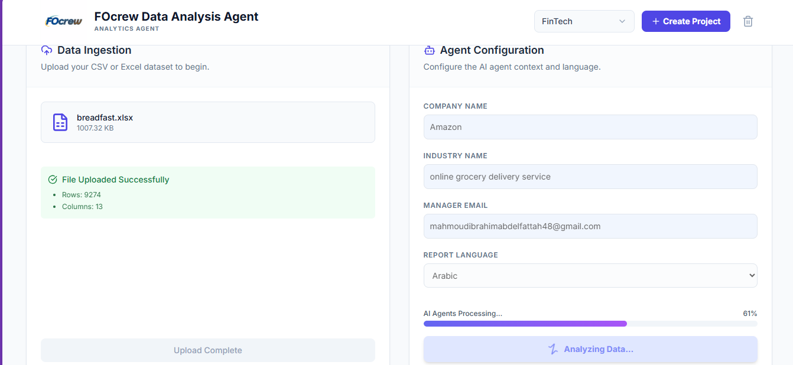

<p align="center">
  
</p>



<h1 align="center">
  🌟 FOcrew: Future-Oriented Crew
</h1>

<p align="center">
  <strong>Automate, Decide, Scale: Your AI Multi-Agent Operating System.</strong><br>
  A powerful open-source framework for enterprise productivity and intelligent decision support.
</p>

---

<p align="center">
  <a href="https://github.com/MahmoudIbrahims/FOcrew/actions/workflows/ci.yml">
    
  </a>
  <a href="#license">
    
  </a>
  
  
</p>

---

## 💡 What is FOcrew?

FOcrew is a highly modular, open-source **Multi-Agent System** designed to revolutionize business automation. Built on Python, FastAPI, and CrewAI, it provides a robust platform for creating specialized, collaborative AI agents that:

* **⚡ Boost Productivity:** Automate time-consuming business processes.
* **📊 Enable Intelligence:** Generate sophisticated data analysis and actionable reports.
* **🧩 Ensure Scalability:** Use a decoupled architecture for easy integration and deployment.

### Key Features

* **Modular Agent Design:** Easily add, remove, or customize specialized agents.
* **Asynchronous Task Handling:** Ready for production with FastAPI backend.
* **PostgreSQL Integration:** Robust data storage for agent memory and history.

---
# Installation Guide

Follow these steps to set up the project environment and run the system locally:

----
* First Download and install Miniconda .

### 1. Clone the Repository
```bash
git clone https://github.com/MahmoudIbrahims/FOcrew.git
cd FOcrew
```
#### 1. Environment Setup

Create and activate a dedicated Python environment:

```bash
conda create -n coreAgent python=3.10
conda activate coreAgent
```

## Environment Configuration
```bash
cd docker/envs

cp .env.example.app .env.app
cp .env.example.postgres .env.postgres
cp .env.example.grafana .env.grafana
cp .env.example.postgres-exporter .env.postgres-exporter
```
### .Set up Alembic for database migrations:
```bash
cd docker/FOcrew
cp alembic.ini.example alembic.ini
```

### .Start the Services:
```bash
cd docker
sudo docker compose up -d --build
```

#### frontend config:
```bash
cd Frontend
npm run dev
```
### . Access the services

- FastAPI Application: http://localhost:8000
- FastAPI Documentation: http://localhost:8000/docs
- Nginx (serving FastAPI): http://localhost
- Prometheus: http://localhost:9090
- Grafana: http://localhost:4000
- website: http://localhost:3000


